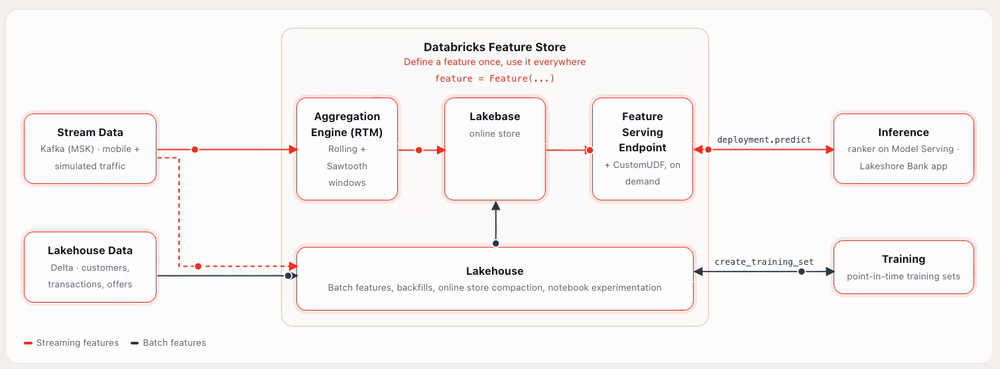

# Real-Time Next-Best-Offer with Databricks Feature Views


Build a personalized banking experience that updates recommendations as customer intent changes.
This accelerator uses **Mosaic AI Feature Engineering**, **Lakebase**, **Model Serving**, and a
**Databricks App** to train and serve a next-best-offer ranker from the same governed feature
definitions.

All data is synthetic and generated deterministically in the included notebooks. No customer data
or PII is included.

## Business story

A customer visits a digital bank to compare cards, savings accounts, loans, mortgages, or
investments. The application combines:

- durable customer attributes and transaction history;
- request-time preferences such as goal, income, spend, and product-page inputs; and
- fresh cross-channel behavior from Kafka.

The result is a ranked offer list that changes with the customer, their stated needs, and their
latest activity. The app also explains the matching signals and includes a live operational view of
serving latency, event throughput, and feature freshness.

## Architecture



1. **Author features once.** Feature Views define batch, rolling, tumbling, Sawtooth, and
   CustomUDF features in Unity Catalog.
2. **Train point-in-time correctly.** Historical feature values join to acceptance labels without
   future leakage, then train a LightGBM ranker registered in Unity Catalog.
3. **Materialize for online use.** Batch and streaming features share one schema and one Lakebase
   online store.
4. **Rank in real time.** A route-optimized Model Serving endpoint looks up customer features and
   scores the offer catalog.
5. **Deliver the experience.** A React Databricks App presents personalized offers, product
   journeys, an architecture walkthrough, and live metrics.

## What the accelerator demonstrates

| Capability | Implementation |
|---|---|
| Batch feature engineering | Sliding, tumbling, and latest-value Feature Views over Delta tables |
| Streaming intent | Kafka events with rolling and Sawtooth windows |
| Derived online features | CustomUDF features evaluated at request time |
| Training and governance | Point-in-time training sets, MLflow, and Unity Catalog lineage |
| Online personalization | Lakebase lookup, route-optimized serving, and a Databricks App |

## Solution flow

The accelerator is organized into two runnable Lakeflow Jobs:

### Part 1 — Feature Views fundamentals

Creates synthetic banking data, defines batch Feature Views, materializes them offline and online,
trains the ranker, and deploys the first online-lookup endpoint.

### Part 2 — Real-time recommendations

Adds Kafka-backed intent features, materializes them to the same Lakebase online store, re-logs the
ranker with streaming signals, and deploys the real-time ranking and Feature Serving endpoints.

Part 2 depends on Part 1. The included end-to-end job runs them in the correct order.

## Repository structure

| Path | Purpose |
|---|---|
| `notebooks/part1_feature_views/` | Data generation, batch features, training, and initial serving |
| `notebooks/part2_realtime_two_stage/` | Kafka ingestion, streaming features, and real-time serving |
| `notebooks/benchmark/` | Serving-latency and event-to-online-freshness measurements |
| `apps/recommender-ui/` | Customer-facing React/AppKit Databricks App |
| `dashboards/` | AI/BI Dashboard for model and feature metrics |
| `resources/` | Lakeflow Jobs, dashboard, and traffic-simulator bundle resources |

## Prerequisites

- Databricks CLI with OAuth authentication and serverless compute enabled.
- A Unity Catalog catalog on standard storage, with permission to create a schema.
- Lakebase and route-optimized Model Serving enabled in the workspace.
- A SQL warehouse for the AI/BI Dashboard and Databricks App.
- For Part 2: a Unity Catalog Kafka connection and service credential with network access to MSK.

Batch and streaming features must use the **same catalog, schema, and online store**. The default
deployment creates a per-user schema to avoid collisions in shared workspaces.

## Deploy the accelerator

1. Authenticate to the target workspace:

   ```bash
   databricks auth login --host https://<workspace-host> --profile <profile>
   ```

2. Validate and deploy the bundle:

   ```bash
   databricks bundle validate -t dev -p <profile> \
     --var warehouse_id=<warehouse-id>

   databricks bundle deploy -t dev -p <profile> \
     --var warehouse_id=<warehouse-id>
   ```

3. Run Part 1, or opt into the complete streaming path:

   ```bash
   # Batch Feature Views, training, and online serving
   databricks bundle run nbo_part1_feature_views -t dev -p <profile> \
     --var warehouse_id=<warehouse-id>

   # Full solution; requires Kafka/MSK prerequisites
   databricks bundle run nbo_end_to_end -t dev -p <profile> \
     --var warehouse_id=<warehouse-id> \
     --var allow_streaming_online=true
   ```

4. Deploy the current customer application from `apps/recommender-ui/`; its README lists the app
   resource bindings and deployment command.

## Key configuration

| Variable | Default | Description |
|---|---|---|
| `catalog` | `fins_industry_solutions` | Unity Catalog catalog on standard storage |
| `schema` | `nbo_<current_user>` | Per-user schema for all accelerator assets |
| `online_store_name` | `nbo` | Shared Lakebase online store for batch and streaming features |
| `ranker_online_endpoint` | `nbo-ranker-online` | Part 1 ranking endpoint |
| `ranker_realtime_endpoint` | `nbo-ranker-realtime` | Part 2 real-time ranking endpoint |

Kafka connection, service credential, topic, warehouse, app, and streaming-gate values are also
configurable in `databricks.yml`.

## Validate changes

```bash
databricks bundle validate -t dev -p <profile> --var warehouse_id=<warehouse-id>
cd apps/recommender-ui
npm ci
npm run typecheck
npx vitest run shared/recommendation.test.ts
```

## License

Copyright 2026 Databricks, Inc. All rights reserved. Provided under the Databricks License.
See [LICENSE.md](LICENSE.md). Third-party notices are listed in [NOTICE.md](NOTICE.md).
